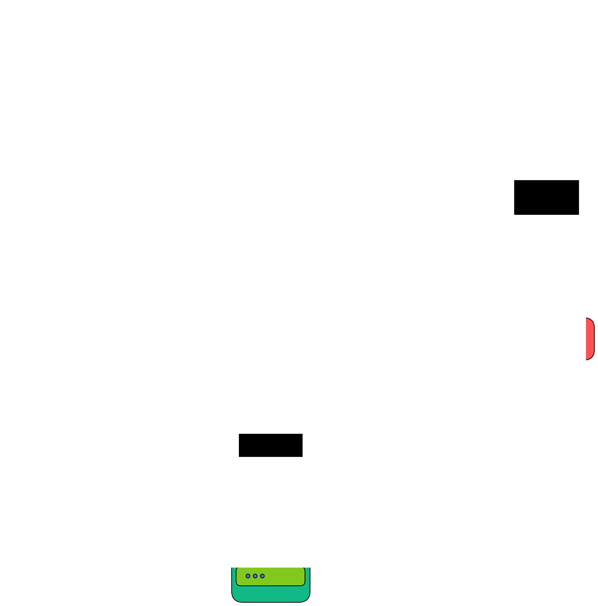

# Architecture

The momentum platform consists of 3 subsystems, which are documented separately in more detail in [their own chapter](#subsystems), as well as a REDCap instance and a MongoDB instance.

### Pipeline

1. A Researcher uses the **Designer** to create a study file (.json)
2. The **Designer** sends the study file to the **Backend** via _HTTP_.
There is also the possibility to create a REDCap project.
In this case the **Designer** sends an _HTTP_ request to the **Backend**, which handles it by sending an _HTTP_ request to the **REDCap** instance in accordance with the REDCap API.
3. The **Backend** stores the study file in the **MongoDB** instance.
4. Participants open the **Mobile app** and enter the link pointing to the study.
5. The **Mobile app** sends an _HTTP_ request to the **Backend** and loads the study.
6. Participants will be able to complete the tasks defined in the study.
7. The **Mobile app** sends data packages such as _Responses_ and _Logs_ to the **Backend** via _HTTP_.
8. The **Backend** stores the data it receives by the **mobile app** in the **MongoDB** instance, as well as to the **REDCap** instance according to the REDCap API.
9. The Researcher downloads the data from the **REDCap** instance.

## Subsystems
- [Backend](./backend/overview.md)
- [Designer](./designer/overview.md)
- [Mobile app](./mobile-app/overview.md)

## Sketch

