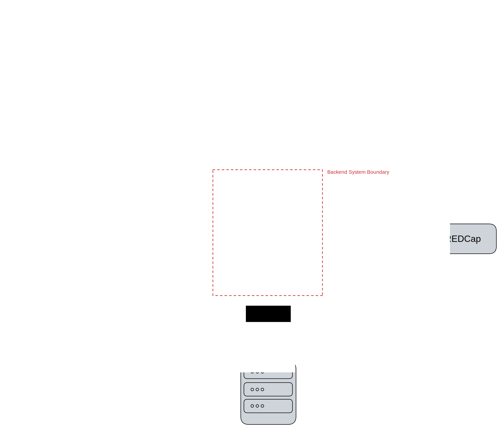

# Interfaces

The Backend shares an interface with each of the following:

- [REDCap](#redcap)
- [mongoDB](#mongodb)
- [Designer](#designer)
- [App](#app)

## REDCap

The Backend has the following unidirectional interactions with the REDCap API:
- Creating REDCap Projects according to the [study schema](../mobile-app/interfaces_study.md)
- Sending Responses it received from the momenTUM app

## mongoDB

## Designer

## App