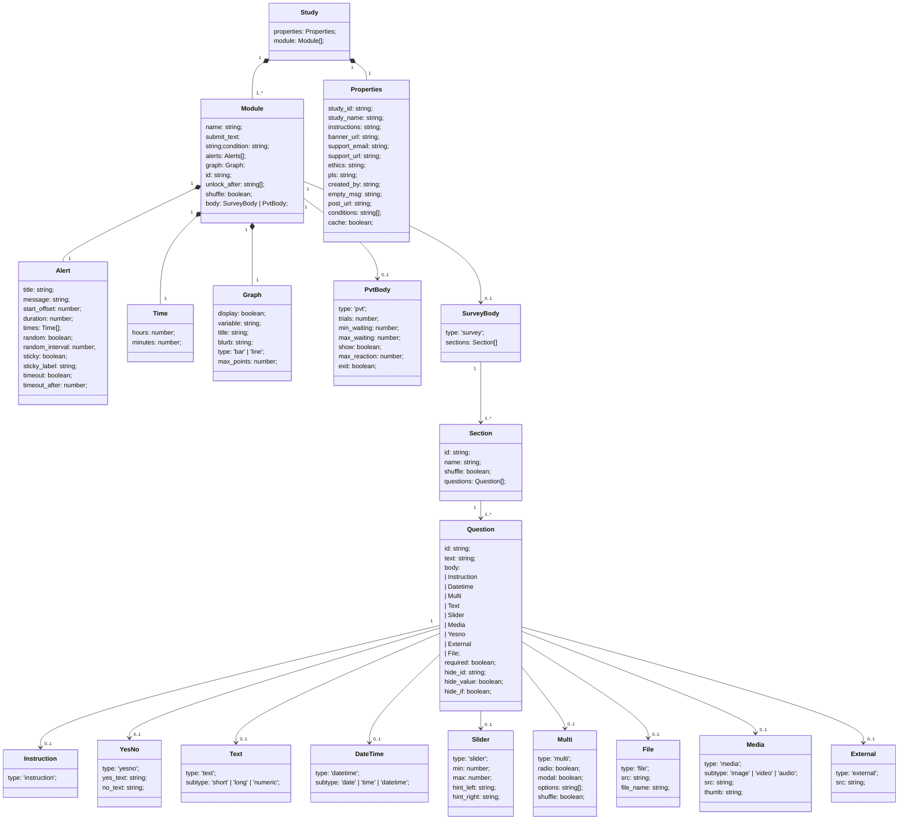

# Study Object

The study object is a complex object with key value pairs according to a certain protocol. The protocol is modelled using a class diagram.
Depending on the programming language, it has been implemented as `interface`(TypeScript) and `Struct` (Rust).

## mermaid diagram

