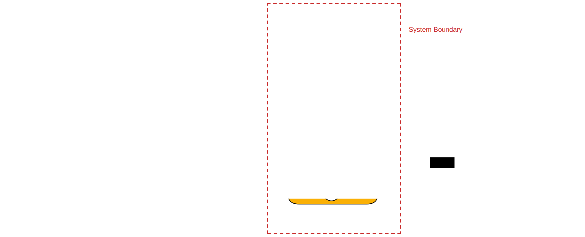

# Interfaces

The Mobile app shares an interface with the following entities:

-   [Participant](#participant)
-   [Backend](#backend)

## Participant

The participant interacts with the mobile app by using its GUI.
The GUI enables participants to complete intervention tasks such as surveys or PVTs.
Participants also enter the link to the [study object](../designer/study_object.md).

## Backend

The Mobile app fetches a study JSON object from the [Backend](../backend/overview.md) via `HTTP GET`. The study JSON object must follow the structure as defined in this chapter:

> [study object](../designer/study_object.md)

The app sends the participant's responses as well as log data to the [Backend](../backend/overview.md).
