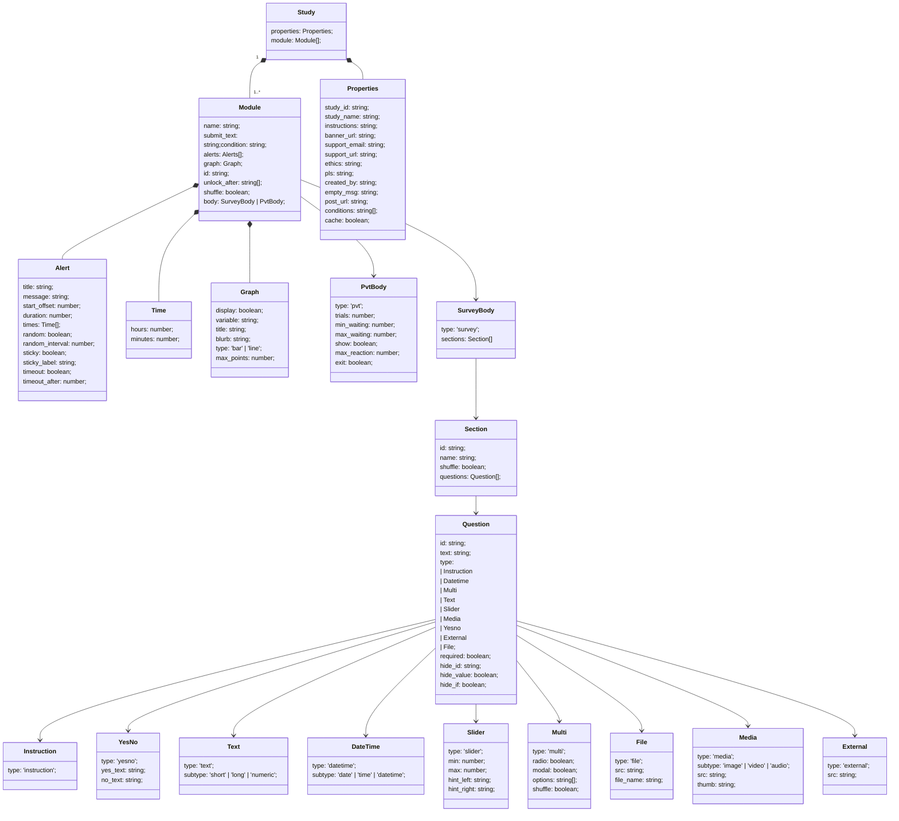

# Study File

The study file is modelled using a class diagram.
Depending on the programming language, it has been implemented as `interface`(TypeScript) and `Struct`(Rust).
The chart was created using [lucid.app](https://lucid.app)
> [edit chart](https://lucid.app/lucidchart/0254693e-6e79-4ecf-889b-467fbcc3ad28/edit?viewport_loc=-1386%2C-525%2C6983%2C3993%2CHWEp-vi-RSFO&invitationId=inv_775f17bc-cc7b-4de3-9402-f161610e2cef)

## mermaid diagram

